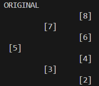
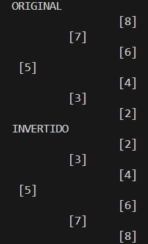

Practica: Estructuras no Lineales
Datos del Estudiante
Nombre: Nicolás Aguilar
Fecha: 19/06/2026
Grupo: 1
# CLASE 1
1. Creacion de arboles de numeros y de personas

FECHA: 17/06/2026 

Descripción: En esta practica lo que hicimos fue crear un arbol de tipo entero, luego procedimos a crear el metodo para poder agregar nodos y que se vaya creando un arbol en orden, menores a izquierda y mayores a derecha, todo esto con recursividad.
# CLASE 2
2. Creacion de preOrder, posOrder e inOrder

FECHA: 19/06/2026 

Descripción:
Empezamos creando el posorder, preOrder e inOrder en el arbol de enteros, luego creamos la forma de calcular su altura y peso. Luego creamos un arbol de tipo generico y luego lo hicimos de tipo persona, modificamos su compareTo para que compare por edad y si son iguales se compare alfabeticamente.
# CLASE 3
3. Creacion de Ejercicio 1 y Ejercicio 2

FECHA: 22/06/2026

Descripcion:
En el ejercicio 1 lo que hicimos fue crear un arbol de tipo entero y luego lo agregamos con el metodo add, luego printeamos de manera horizontal el arbol:

En el ejercicio 2 hicimos lo mismo de crear un arbol pero esta vez al ejercicio 2 solo le pasamos la root, el arbol lo creamos en el app, dentro de el ejercicio 2 lo que hicimos fue invertir el arbol, se lo invierte y luego se hace las llamadas recursivas para ir invirtiendo todo el arbol.
Se debe printear el arbol antes de invertirlo y luego de, tal que asi:

# Clase 4
4. Resolucion de ejercicios 4 y 5

Fecha: 24/06/2026

Descripcion:
Se hizo el ejercicio 3 y 4, en el 3 se printeaba los nodos que tenia por cada nivel, para lo cual se creó un algoritmo para saber el nivel del arbol, luego fuimos viendo que nodo tenia que nivel y se lo printeaba, eso se lo hizo con colas.
El ejercicio 4 fue solo saber el nivel del arbol, algortmo que ya teniamos antes en el 3.