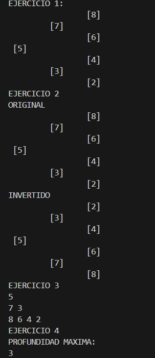

# Informe practica estructuras no Lineales
Nicolás Aguilar
ICC

## CLASE 1
1. Creacion de arboles de numeros y de personas (17/06/2026)
```
    public void add(int value){
            Node<Integer> node = new Node<Integer>(value);
            root = addRecursivo(root, node);
            peso++;
        }
        private Node<Integer> addRecursivo(Node<Integer> actual, Node <Integer> nodeInsertar){
            if(actual == null){
                return nodeInsertar;
            }
            if(actual.getValue()> nodeInsertar.getValue()){
                //izq
                actual.setLeft(addRecursivo(actual.getLeft(), nodeInsertar));
            }else{
                //der
                actual.setRight(addRecursivo(actual.getRight(), nodeInsertar));
            }
            return actual;
        }
```

crear un arbol de tipo entero y luego crear el metodo para poder agregar nodos y que se vaya creando un arbol en orden, menores a izquierda y mayores a derecha, todo esto con recursividad.

## CLASE 2
2. Creacion de preOrder, posOrder e inOrder
```
    public void preOrder(){
        preOrderRecursivo(root);
    }

    public void preOrderRecursivo(Node<T> actual) {
      if(actual == null)
        return;
    
        System.out.print(actual+ ",");
        preOrderRecursivo(actual.getLeft());
        preOrderRecursivo(actual.getRight());
    }
    public void posOrder(){
        posOrderRecursivo(root);
    }

    public void posOrderRecursivo(Node<T> actual) {
        if(actual == null)
            return;
    
        posOrderRecursivo(actual.getRight());
        posOrderRecursivo(actual.getLeft());
        System.out.print(actual+ ",");
    }

    public void inOrder(){
        inOrderRecursivo(root);
    }

    public void inOrderRecursivo(Node<T> actual) {
        if(actual == null)
            return;
    
        
        inOrderRecursivo(actual.getLeft());
        System.out.print(actual+ ",");
        inOrderRecursivo(actual.getRight());
        
    }
```
Creamos los metodos recursivos de preOrder, posOrder e InOrder, todo eso para poder imprimir nuestros arreglos de la manera en que deseemos, basandonos en las formas de imprimir los arboles.

## CLASE 3
3. Creacion de Ejercicio 1 y Ejercicio 2

package structure.node.trees;


```
public class Ejercicio1 {

    //insertar cada numero
    public void insert(int[]numeros){
        BinaryTree<Integer> tree = new BinaryTree<>();
        for(int numero : numeros){
            tree.add(numero);
        }
        
        tree.prinTree();

    }
```


```
public void prinTree(){
        printTreeRecursivo(root, 0);
    }
    public void printTreeRecursivo(Node<T> actual, int nivel){
        if(actual == null)
            return;
        printTreeRecursivo(actual.getRight(),nivel+1);
        for (int i = 0; i < nivel; i++) {
            System.out.print("\t"); 
        }
        System.out.println(actual);  
        printTreeRecursivo(actual.getLeft(),nivel+1);
          
    }
```
Aqui se muestra el codigo del Ejercicio1, tambien su print recusrivo, el cual genera tabulaciones segun el nivel del nodo.

```
public void invertTree(Node<Integer>root){
        System.out.println("ORIGINAL");
        prinTree(root);
        invertTreeRecursivo(root);
        System.out.println("INVERTIDO");
        prinTree(root);
    }
    public void invertTreeRecursivo(Node<Integer> root) {

        if(root == null){
            return;
        }
        //INVERTIMOS
        Node<Integer> aux = root.getLeft();
        Node<Integer> der = root.getRight();
        root.setLeft(der);
        root.setRight(aux);
        //recursividad
        invertTreeRecursivo(root.getLeft());
        invertTreeRecursivo(root.getRight());

    }


    public void prinTree(Node<Integer> root){
        printTreeRecursivo(root, 0);
    }
    public void printTreeRecursivo(Node<Integer> actual, int nivel){
        if(actual == null)
            return;
        printTreeRecursivo(actual.getRight(),nivel+1);
        for (int i = 0; i < nivel; i++) {
            System.out.print("\t"); 
        }
        System.out.println(actual);  
        printTreeRecursivo(actual.getLeft(),nivel+1);
          
    }
```
Aqui está el ejercicio 2 el cual ocupamos recursividad para primero invertir el arbol nodo por nodo y para printearlo tambien, lo que se hizo fue primero empezar en el nodo raiz e invertir su left y right y luego pasamos a cada rama y hoja y se hizo lo mismo.

## Clase 4
4. Resolucion de ejercicios 4 y 5 (24/06/2026)

```
public void imprimirNiveles(Node<Integer> root){

        int altura = profundidadMax(root);

        for(int nivel = 1; nivel <= altura; nivel++){

            imprimirNivel(root, nivel);

            System.out.println();
        }
    }

    private void imprimirNivel(Node<Integer> root, int nivel){

        if(root == null){
            return;
        }

        if(nivel == 1){
            System.out.print(root.getValue() + " ");
        }
        else{
            imprimirNivel(root.getLeft(), nivel - 1);
            imprimirNivel(root.getRight(), nivel - 1);
        }
    }

    private int profundidadMax(Node<Integer> root){

        if(root == null){
            return 0;
        }

        int izquierda = profundidadMax(root.getLeft());
        int derecha = profundidadMax(root.getRight());

        return Math.max(izquierda, derecha) + 1;
    }
```


Printeaba los nodos que tenia por cada nivel, para lo cual se creó un algoritmo para saber el nivel del arbol, luego fuimos viendo que nodo tenia que nivel y se lo printeaba, eso se lo hizo con colas.

```
    public int profundidadMax(Node<Integer> root){

        if(root == null){
            return 0;
        }

        int izquierda = profundidadMax(root.getLeft());
        int derecha = profundidadMax(root.getRight());

        return Math.max(izquierda, derecha) + 1;
    }
```

El ejercicio 4 fue solo saber el nivel del arbol, algortmo que ya teniamos antes en el 3.


La salida por consola de el programa muestra el resultado de los 4 ejercicios:





